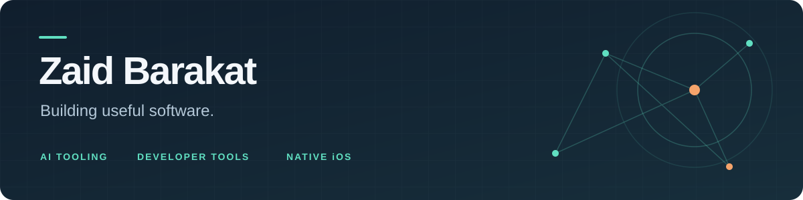

**Computer Science student @ Texas A&M University**

[LinkedIn](https://www.linkedin.com/in/zaidfbarakat) · [Projects](#selected-projects) · [Workflow](#how-i-work)

I turn ideas into working software, then dig into the details that make it useful. My projects span repository Q&A, defensive AI security, interactive learning tools, and native iPhone apps. Python is my home base; lately, I've also been building with Swift and SwiftUI.

## Latest build · Morning Reset

A native, offline iPhone app for building a more intentional morning routine. Guided tasks and timers pair with a step-by-step Shortcuts setup that redirects distracting apps during a routine.

**Swift · SwiftUI · App Intents · iOS 17+**  
Personal project · Tested on a real iPhone · Source currently private

## Selected projects

| Project | Engineering focus |
| :--- | :--- |
| **[Repo QA Agent](https://github.com/zaid-brk/repo-qa-agent)** | Ask questions about a GitHub repository and get answers with source citations. Combines retrieval with a multi-hop agent and a **50-question evaluation harness**. Python · FastAPI · LangChain · Qdrant · Next.js |
| **[Injection Redteam](https://github.com/zaid-brk/injection-redteam)** | A defensive prompt-injection testing framework with **42 attacks across 6 categories**, attack-success benchmarking, and layered defenses. Python · Defensive AI security |
| **[Algorithm Steps](https://github.com/zaid-brk/algorithm-steps)** | An interactive algorithm tutor with line-by-line Python walkthroughs, variable snapshots, and a custom-problem tutor. JavaScript · HTML · CSS |

## How I work

I use **Codex and Claude Code** in my AI-assisted development workflow to accelerate prototyping, debugging, and iteration. I stay involved in requirements, design decisions, and testing so that faster development leads to useful results.

My projects include concrete ways to check the work: evaluation questions for repository Q&A, attack-and-defense benchmarks for AI security, and real-device testing for Morning Reset.

## Toolkit

| Area | Tools |
| :--- | :--- |
| Backend | Python · FastAPI |
| AI tooling & retrieval | LangChain · Qdrant |
| Interfaces | Next.js · Streamlit · HTML · CSS |
| Native iOS | Swift · SwiftUI · App Intents |
| Development workflow | Codex · Claude Code · Git · GitHub |

---

**Have an interesting problem or project?**  
[Let's connect on LinkedIn →](https://www.linkedin.com/in/zaidfbarakat)

